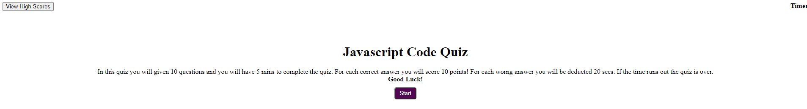

# Homework-4-Code-Quiz

This is a JavaScript Code Quiz

In this quiz you will given 10 questions and you will have 5 mins to complete the quiz. For each correct answer you will score 10 points! For each worng answer you will be deducted 20 secs. If the time runs out the quiz is over.
